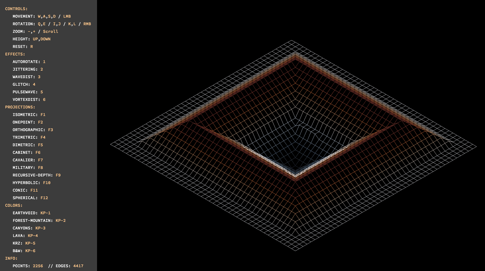
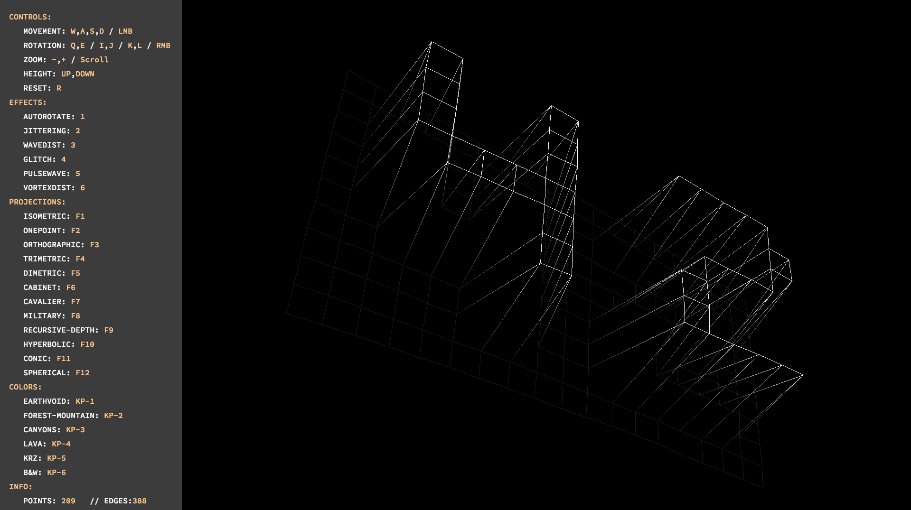
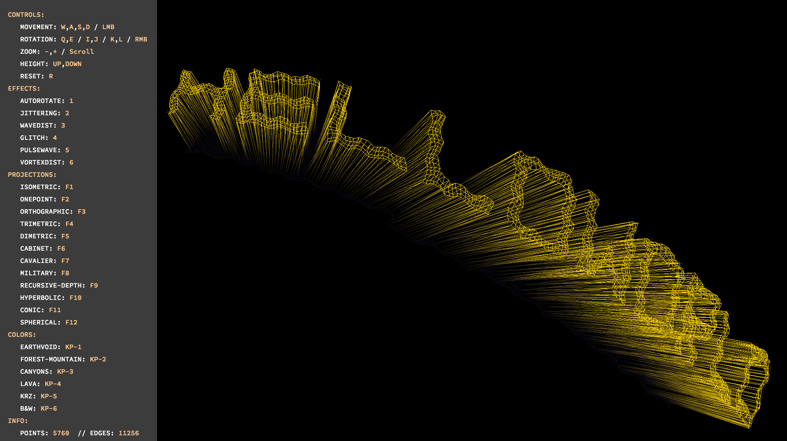
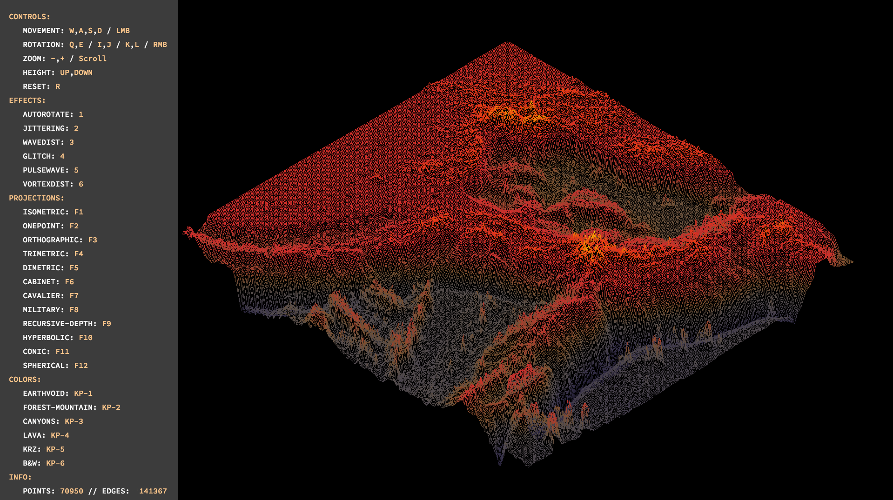
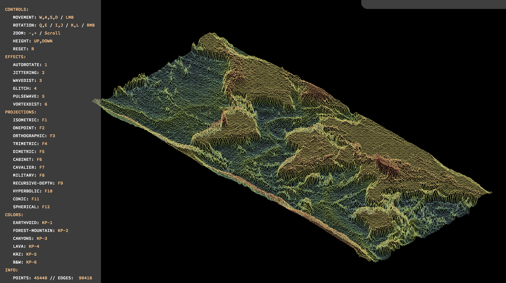
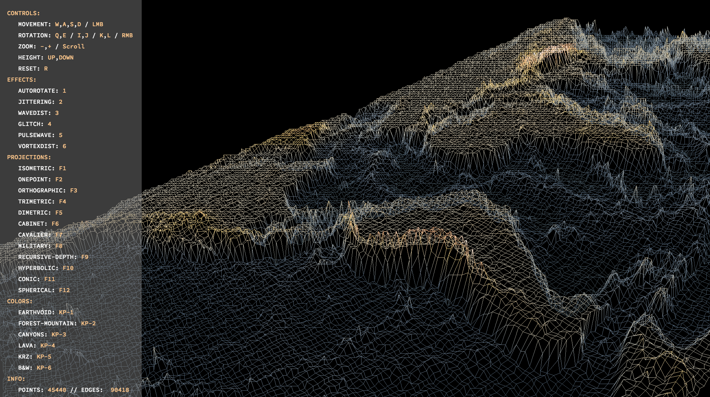
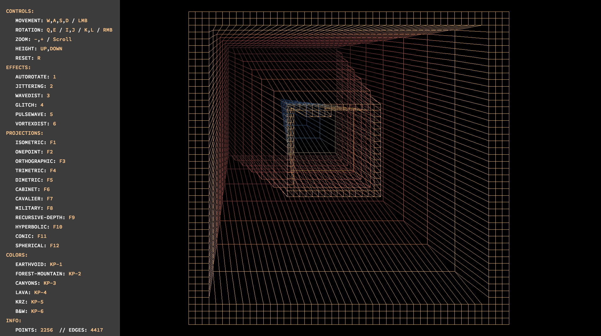

# <h1 align="center">FDF++</h1>

<p align="center">
   <b>A map-based wireframe renderer written in C++ and built on MLX42</b><br>
</p>

---

<p align="center">
    
    
    
    
    
    
    
    
</p>

## General Description

FDF++ is a powerful and extensible wireframe renderer for 3D maps, written in modern C++. It leverages the MLX42 graphics library to provide smooth rendering, interactive controls, and a rich set of features for map visualization, color management, projections, and visual effects. The project is designed for educational and creative purposes, allowing users to explore mathematical projections, color palettes, and custom map building. It is based on 42's Common Core's FDF project, which is asked to be written in C, as a side activity to train my C++ skills and OOP muscles. It also served as an opportunity to add a handful of extra features to the usual FDF project and try to come up with interesting build ideas.

## Preview





## Build & Execution Instructions

### Prerequisites
- **C++ Compiler**: g++ or clang++ with C++11 support or higher
- **CMake**: Version 3.10 or higher
- **MLX42**: Graphics library (see [MLX42 documentation](https://github.com/codam-coding-college/MLX42) for installation)
- **OpenGL**: Required by MLX42 for rendering

### Installation Steps

1. **Clone the repository:**
   ```bash
   git clone https://github.com/hugomgris/FDFPP.git
   cd FDFPP
   ```

2. **Install dependencies:**
   - Ensure MLX42 is properly installed and configured
   - On macOS: MLX42 should work with the system's OpenGL framework
   - On Linux: Install OpenGL development libraries (`mesa-common-dev`, `libgl1-mesa-dev`)

3. **Build the project:**
   ```bash
   make
   ```

4. **Run the application:**
   ```bash
   ./FDF++ <mapfile.fdf> OR <string-to-convert-to-map>
   ```

### Example Usage
```bash
# Run with a sample map
./FDF++ maps/42.fdf
./FDF++ maps/test_maps/pylone.fdf
./FDF++ helloworld
```

Example maps are available in the `maps/` directory, including terrain data, geometric patterns, and test files.





## Detailed Features

### Color Palettes
FDF++ features an advanced color management system with multiple built-in palettes and smooth interpolation:

- **6 Built-in Palettes**: Switch between different color schemes using numpad keys 1-6
- **Height-based Coloring**: Colors automatically map to elevation values
- **Smooth Interpolation**: Gradual color transitions between adjacent points
- **Gradient Rendering**: Lines display color gradients from point to point
- **Custom Color Support**: Extensible system for adding new color schemes

**Palette Controls:**
- `Numpad 1-6`: Switch between color palettes
- Colors automatically adjust based on map height values

### Projections
Experience your maps through 12 different mathematical projection systems:

1. **F1 - Isometric**: Classic 3D technical drawing style with equal axis scaling
2. **F2 - Perspective**: Realistic depth perception with configurable viewing distance
3. **F3 - Orthographic**: Flat, parallel projection without perspective distortion
4. **F4 - Trimetric**: Advanced axonometric with three different axis angles
5. **F5 - Dimetric**: Two axes equally foreshortened for balanced 3D view
6. **F6 - Cabinet**: Oblique projection with 50% depth scaling
7. **F7 - Cavalier**: Full-scale oblique projection at 45-degree angle
8. **F8 - Military**: Simple side-view projection
9. **F9 - Recursive Depth**: Looping depth effect for infinite-seeming structures
10. **F10 - Hyperbolic**: Non-linear scaling based on hyperbolic geometry
11. **F11 - Conic**: Complex perspective with rotational transformations
12. **F12 - Spherical Conic**: Spherical surface mapping with conic projection

Each projection offers unique visual characteristics and mathematical properties, perfect for exploring different ways to visualize 3D data.

### Visual Effects (VFX)
Add dynamic visual flair to your wireframes with real-time effects:

- **Auto-Rotation** (`1`): Continuous automatic rotation around the Z-axis
- **Jitter** (`2`): Random displacement for a hand-drawn aesthetic
- **Wave Distortion** (`3`): Sinusoidal wave patterns that ripple across the wireframe
- **Glitch** (`4`): Random displacement effects for digital corruption aesthetics
- **Pulse Wave** (`5`): Radial wave distortion emanating from the screen center
- **Vortex Distortion** (`6`): Rotational distortion creating swirling effects

**Effect Features:**
- **Real-time Rendering**: All effects update continuously during playback
- **Combinable Effects**: Multiple effects can be active simultaneously
- **Time-based Animation**: Effects use time parameters for smooth animation
- **Center-based Effects**: Pulse and vortex effects use screen center as origin
- **Configurable Intensity**: Effect strength can be adjusted

### Text-to-Map Builder
Transform text into 3D wireframe maps using a comprehensive character dictionary:

- **Dictionary System**: 24-line high bitmap font for each character
- **String Input**: Convert any text string into a height map
- **Character Support**: Full uppercase alphabet and numbers
- **Automatic Scaling**: Characters are properly spaced and sized
- **Real-time Generation**: Maps are built and rendered immediately

**Usage:**
- Run the program with a string argument instead of a map path (check usage examples above)
- Input text will be converted using the character dictionary
- Each character becomes a 3D representation in the wireframe

## Controls

### Camera Controls
- **Mouse Left Drag**: Pan/move the view around
- **Mouse Right Drag**: Rotate the map in 3D space
- **Scroll Wheel**: Zoom in/out (centered on mouse position)
- **Arrow Keys ↑/↓**: Adjust Z-axis scaling (height amplification)
- **WASD**: Alternative panning controls
- **+/- (Numpad)**: Zoom in/out from center

### Rotation Controls
- **Q/E**: Rotate around Z-axis (roll)
- **I/K**: Rotate around X-axis (pitch)
- **J/L**: Rotate around Y-axis (yaw)

### Projection & Visual Controls
- **F1-F12**: Switch between projection types
- **Numpad 1-6**: Change color palettes
- **1**: Toggle auto-rotation
- **2**: Toggle jitter effect
- **3**: Toggle wave distortion
- **4**: Toggle glitch effect
- **5**: Toggle pulse wave effect
- **6**: Toggle vortex distortion effect

### System Controls
- **R**: Reset all settings (camera, rotation, effects)
- **T**: Open text-to-map builder (when applicable)
- **H**: Show/hide help overlay (if implemented)
- **ESC/Q**: Quit application

### Mouse Controls
- **Left Click + Drag**: Pan the map view
- **Right Click + Drag**: 3D rotation
- **Scroll Wheel**: Zoom with mouse-centered scaling



## Technical Architecture

FDF++ follows a modular architecture with clear separation of concerns:

- **FDF Class**: Main orchestrator managing all components
- **Renderer**: Handles wireframe drawing and VFX application  
- **Camera**: Manages viewport transformations and user interaction
- **Projector**: Factory for different projection algorithms
- **ColorManager**: Height-based color interpolation and palette management
- **VFX Engine**: Real-time visual effects processing
- **MapBuilder**: File parsing and text-to-map conversion
- **MLXHandler**: Window management and event handling

This design ensures extensibility, maintainability, and performance optimization for real-time rendering.

## Documentation

This project is fully documented using [Doxygen](https://www.doxygen.nl/).


### How to Generate Documentation

1. **Run the documentation build:**
   - From the project root, simply run:
     ```sh
     make doxy
     ```
   - If Doxygen is not installed, this rule will automatically download and set up a local copy for you.

2. **Optional: Install Graphviz for diagrams:**
   - If [Graphviz](https://graphviz.gitlab.io/) is installed (`sudo apt-get install graphviz`), the generated documentation will include class diagrams and inheritance graphs for better visualization.

3. **View the documentation:**
   - Open `docs/index.html` in your web browser to browse the full documentation, including class descriptions, file overviews, method details, and (if Graphviz is present) graphical diagrams.

### What is Documented?
- All major classes, methods, and files are annotated with Doxygen comments.
- Mathematical details for each projection type are included in the documentation.
- The documentation covers:
  - Core rendering pipeline (FDF, Renderer, Camera, ColorManager, VFX, UI)
  - Map parsing and building (Map, MapBuilder, MapParser)
  - All projection algorithms (Isometric, Orthographic, Cabinet, Cavalier, Trimetric, Dimetric, Military, Perspective, RecursiveDepth, Hyperbolic, Conic, SphericalConic)
  - Usage instructions and control schemes

For a high-level overview, see `docs/mainpage.dox`.

## Acknowledgements

This project owes a lot to my beloved 42 partner Nico (/mrlouf), who did a very good FDF project which I used as reference to build my C++ version.

You can check out his work at https://github.com/mrlouf/fdf

Thanks, Nico <3

The work by @ailopez-o for their FDF project at 42 was also a huge inspiration.

You can check their repo at https://github.com/ailopez-o/42Barcelona-FdF (some of the maps included in my repo are taken from there, so thanks for that too!)

---
